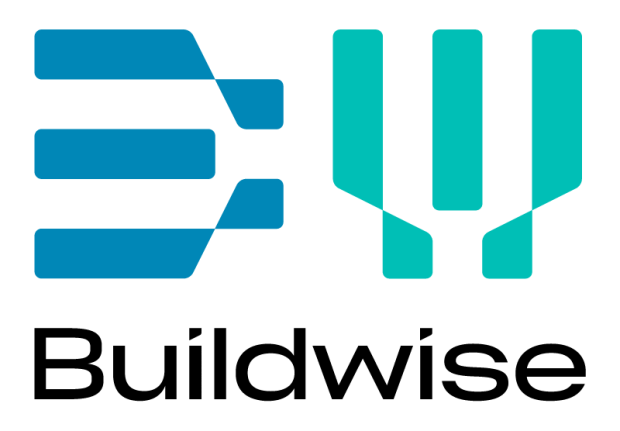

# Meetstaat Inc. - Analyse-instrument voor Bouwdocumenten


<p align="center">
  
</p>

Welkom bij de **AI-Construct Structuurchecker**, een geavanceerd hulpmiddel ontworpen om de structurele integriteit van bouwspecificatiedocumenten (`Lastenboeken`) te analyseren. Deze lokaal gehoste webapplicatie stelt u in staat om elk PDF-document te uploaden en een diepgaande, AI-gestuurde analyse te ontvangen van de plaatsing van taken en de algehele organisatie. Het doel is om potentiële inconsistenties, omissies en misplaatsingen te identificeren voordat ze kostbare problemen worden op de bouwplaats.

## Hoe het werkt

De applicatie combineert de kracht van geavanceerde OCR met de redeneercapaciteiten van Large Language Models (LLMs) om een naadloze analyse-ervaring te bieden:

1.  **PDF-verwerking met LlamaParse:** Wanneer u een PDF uploadt, wordt deze eerst verwerkt door LlamaParse. Deze krachtige engine extraheert niet alleen de ruwe tekst, maar reconstrueert ook de volledige hiërarchische structuur van het document, inclusief hoofdstukken, secties en subsecties.
2.  **AI-gestuurde Analyse:** De gestructureerde output van LlamaParse wordt vervolgens in batches naar het `gemini-2.5-flash`-model van Google gestuurd. Het model analyseert elke sectie in de context van het hele document om te bepalen of de taken en specificaties logisch geplaatst zijn.
3.  **Interactieve UI:** De analyseresultaten worden gepresenteerd in een duidelijke en interactieve webinterface. Hier kunt u eenvoudig door de documentstructuur navigeren, de bevindingen van de AI bekijken, filteren op probleemcategorie en een overzicht op hoog niveau krijgen via het samenvattingsdashboard.

## Hoe te Gebruiken

Het gebruik van de tool is ontworpen om eenvoudig en intuïtief te zijn:

1.  **Start de Applicatie:** Na het volgen van de installatiestappen, start u de lokale webserver. De tool is nu toegankelijk in uw browser.
2.  **Upload een PDF:** De interface biedt een duidelijke optie om een `lastenboek` in PDF-formaat van uw computer te selecteren en te uploaden.
3.  **Wacht op Verwerking:** LlamaParse analyseert uw document. De voortgang is zichtbaar in de interface en het proces duurt doorgaans enkele minuten, afhankelijk van de grootte van het document.
4.  **Start de Analyse:** Zodra de verwerking is voltooid, wordt het bestand beschikbaar in een dropdown-menu. Selecteer het en klik op "Start Analyse" om de AI zijn werk te laten doen.
5.  **Bekijk de Resultaten:** De bevindingen worden direct op de pagina weergegeven. U kunt door de hoofdstukken klikken, de specifieke opmerkingen van de AI lezen en de ernst van de geïdentificeerde problemen beoordelen.

## Technische Details

Deze tool maakt gebruik van geavanceerde technologieën om een diepgaande analyse te bieden:

-   **OCR en Documentstructurering:** Wij gebruiken **LlamaParse** voor Optical Character Recognition (OCR) en het structureren van documenten. OCR is het proces waarbij tekst uit afbeeldingen of gescande documenten wordt omgezet in machineleesbare tekst. LlamaParse extraheert niet alleen de tekst, maar ook de hiërarchische structuur (hoofdstukken, secties) van het document, wat essentieel is voor een contextuele analyse.
-   **Structurele Analyse:** Voor de daadwerkelijke analyse van de documentstructuur maken we gebruik van gebundelde (batched) aanroepen naar het **`gemini-2.5-flash`-model** van Google. Door meerdere secties tegelijk te analyseren, kan het model de context van het hele document beter begrijpen en de analyse aanzienlijk versnellen. Een voorbeeld van het gestructureerde JSON-bestand dat als input voor deze stap wordt gebruikt, is te vinden in `examples/example_anonymized_specification.json`.
-   **Data Privacy (GDPR):** Alle AI-modellen worden aangeroepen via de **Vertex AI**-service van Google Cloud, die draait op een **Belgische server (`europe-west1`)**. Dit garandeert volledige conformiteit met de GDPR-regelgeving, aangezien uw gegevens de EU niet verlaten.

## Aan de slag

### Vereisten

-   Python 3.8+
-   `pip` voor pakketbeheer
-   Google Cloud SDK (`gcloud`) geïnstalleerd en geauthenticeerd. U moet ingelogd zijn via `gcloud auth application-default login`.

### Installatie

1.  **Kloon de repository:**
    ```bash
    git clone <repository-url>
    cd Meetstaatincorp
    ```

2.  **Stel een virtuele omgeving in:**
    ```bash
    python -m venv venv
    source venv/bin/activate  # Gebruik op Windows `venv\\Scripts\\activate`
    ```

3.  **Installeer de afhankelijkheden:**
    ```bash
    pip install -r requirements.txt
    ```

4.  **Stel Omgevingsvariabelen in:**
    Dit project vereist API-sleutels voor Google Cloud en LlamaParse. De aanbevolen manier om deze in te stellen is via omgevingsvariabelen.

    **Voor LlamaParse:**
    Stel de `LLAMA_CLOUD_API_KEY` omgevingsvariabele in op uw sleutel. Voor Conda-omgevingen kunt u dit permanent instellen:
    ```bash
    conda env config vars set LLAMA_CLOUD_API_KEY="uw_llama_cloud_api_sleutel"
    ```
    Als alternatief kunt u voor lokale ontwikkeling een `.env`-bestand in de hoofdmap van het project aanmaken en de sleutel daar toevoegen:
    ```
    LLAMA_CLOUD_API_KEY="uw_llama_cloud_api_sleutel"
    ```

5.  **Google Cloud Authenticatie:**
    Zorg ervoor dat u bent geauthenticeerd met de `gcloud` CLI:
    ```bash
    gcloud auth application-default login
    ```

### De Applicatie Draaien

Om de Flask-webserver te starten, voert u het volgende commando uit:
```bash
python task_placement_analyzer_app.py
```
De applicatie zal beschikbaar zijn op `http://127.0.0.1:5002`.
